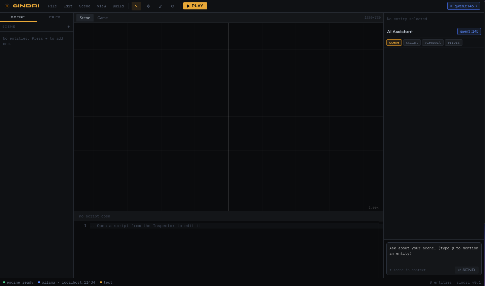

# Sindri

Sindri is a 2D game engine, editor workspace, and local AI-assisted tooling stack written in Rust.

It combines:

* a lightweight Rust engine core
* Lua entity scripting with hot reload
* a local-first editor/runtime workflow
* an Axum-based engine server
* Ollama-powered local AI tooling
* scene serialization and editor integration
* a curated example suite focused on real workflows instead of subsystem spam

The goal is not just to render sprites.

The goal is to make gameplay iteration, scripting, tooling, and editor workflows feel cohesive.

Sindri is designed around a simple idea:

> Rust owns the engine.
> Lua owns gameplay behavior.
> The editor and AI should understand both.



> Early Sindri editor prototype with scene viewport, script editing, and local AI tooling.

---

# What Makes Sindri Different

Sindri is not trying to become a giant everything-engine.

Instead, it focuses on:

* fast gameplay iteration
* lightweight ECS-style workflows
* Lua-first gameplay scripting
* local AI-assisted tooling
* editor/runtime convergence
* approachable engine architecture

The engine already supports:

* hardware-accelerated 2D rendering via `wgpu`
* Rapier2D physics
* Lua scripting through `mlua`
* tilemaps, particles, lighting, and text rendering
* scene serialization
* undo/redo commands
* hot-reloadable gameplay scripts
* local AI action execution through Ollama

The repository also contains the in-progress Sindri editor stack:

* a local Axum engine/editor server
* a Tauri + React editor prototype
* AI tooling for entity and scene manipulation

No external AI API is required.

---

# Workspace

```text
crates/
  sindri/          Engine core
  sindri-server/   Local engine/editor HTTP server
  sindri-ai/       Ollama client and AI action types

editor/            Tauri 2 + React editor
examples/          Curated examples and reference games
docs/              Engine documentation
```

---

# Curated Example Suite

The public examples are intentionally small and opinionated.

Sindri avoids accumulating dozens of abandoned feature demos.

Instead, each example is meant to demonstrate a real workflow or engine identity surface.

| Example              | Purpose                                                        |
| -------------------- | -------------------------------------------------------------- |
| `hello_sindri`       | Minimal onboarding                                             |
| `platformer`         | Rust-first gameplay and physics                                |
| `scripted_asteroids` | Lua scripting and hot reload flagship                          |
| `editor_scene`       | Scene loading and editor workflow                              |
| `rendering`          | Particles, lighting, camera effects, and object-count showcase |

---

# Quick Start

Build the workspace:

```bash
cargo build --workspace
```

Run the onboarding example:

```bash
cargo run -p hello_sindri
```

Run the scripting showcase:

```bash
cargo run -p scripted_asteroids
```

---

# Editor Workflow

Start the local server:

```bash
cargo run -p sindri-server
```

Start the editor:

```bash
cd editor
pnpm install
pnpm tauri dev
```

The editor communicates with the local engine server on:

```text
127.0.0.1:7878
```

AI features use local Ollama models.

Sindri intentionally keeps AI workflows local-first.

---

# Lua Scripting

Sindri uses entity-attached Lua scripts with lifecycle callbacks, deferred world mutation, physics helpers, and hot reload.

Scripts are designed for:

* player controllers
* enemy logic
* triggers
* camera behavior
* weapons
* gameplay scripting
* editor-attached entity behavior

Example:

```lua
local speed = params.speed or 220.0

function on_update(self, dt)
  local input = self:input()
  local transform = self:transform()

  if transform == nil then
    return
  end

  local move = input:axis("A", "D")
  local pos = transform:position()

  transform:set_position(
    vec2(pos.x + move * speed * dt, pos.y)
  )
end
```

Scripts support:

* `on_update`
* `on_fixed_update`
* collision callbacks
* triggers
* world queries
* spawning/despawning
* physics helpers
* camera helpers
* animation helpers
* hot reload

See:

* `docs/scripting.md`
* `examples/scripted_asteroids`

---

# Minimal Game

```rust
use anyhow::Result;
use sindri::{Camera2D, Engine, EngineContext, Game, KeyCode};

struct MyGame {
    camera: Camera2D,
}

impl Game for MyGame {
    fn init(&mut self, _ctx: &mut EngineContext) -> Result<()> {
        Ok(())
    }

    fn update(&mut self, ctx: &mut EngineContext) -> Result<()> {
        if ctx.input().is_key_pressed(KeyCode::Escape) {
            ctx.request_exit();
        }
        Ok(())
    }

    fn draw(&mut self, ctx: &mut EngineContext) -> Result<()> {
        let renderer = ctx.renderer();

        let mut frame = renderer.begin_frame()?;

        renderer.clear(&mut frame, [0.05, 0.05, 0.08, 1.0])?;

        renderer.end_frame(frame)?;

        Ok(())
    }
}

fn main() -> Result<()> {
    Engine::new()
        .with_title("My Sindri Game")
        .with_size(1280, 720)
        .with_vsync(true)
        .run(MyGame {
            camera: Camera2D::default(),
        })
}
```

---

# Core Features

## Engine

* `wgpu` rendering
* Rapier2D physics
* batched sprites, shapes, tilemaps, particles, text, and lighting
* offscreen rendering and screenshot support
* cameras, zoom, bounds, and world/screen conversion
* frame-accurate input and action mapping
* HUD rendering
* audio through `rodio`
* A* pathfinding and typed grids

## World / ECS

* lightweight `World` + `EntityId`
* immutable and mutable queries
* built-in gameplay components
* fluent `EntityBuilder`
* gameplay tags and helpers

## Scripting

* Lua 5.4 through `mlua`
* entity-attached scripts
* lifecycle callbacks
* deferred command buffering
* hot reload
* world queries and safe spawning/despawning
* physics, animation, camera, tilemap, and input helpers

## Editor / AI

* scene hierarchy
* component inspection
* script editing
* viewport preview
* local AI chat
* AI-assisted entity and component actions
* adoption/parity tracking between engine/editor/AI

---

# Adoption / Parity Matrix

Sindri tracks feature adoption across:

* engine
* runtime
* editor
* serialization
* AI tooling

The goal is to prevent subsystem drift where:

* the engine supports a feature
* the editor partially supports it
* AI tooling does not understand it
* serialization silently breaks

See:

```text
docs/adoption-parity-matrix.md
```

---

# Current Status

The engine core is functional and actively evolving.

Current work focuses on:

* editor/runtime parity
* Lua-first workflows
* AI-assisted tooling
* scene workflows
* curated example quality
* editor adoption of engine systems

The editor is still in active development and does not yet expose every engine capability.

---

# Documentation

Recommended starting points:

* `docs/getting-started.md`
* `docs/scripting.md`
* `docs/world.md`
* `docs/rendering.md`
* `docs/physics.md`
* `docs/examples.md`
* `docs/adoption-parity-matrix.md`

---

# Requirements

* Rust 2021+
* GPU drivers supported by `wgpu`
* `pnpm` for the editor
* Ollama for local AI workflows

---

# License

MIT OR Apache-2.0
